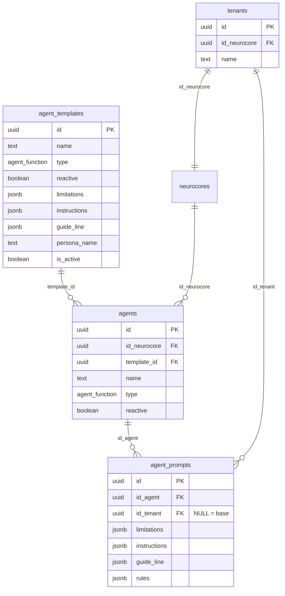

# Plano de Implementação: Agent Templates UI (Meus Agentes IA)

**Feature:** Plataforma Tenant - Interface para visualizar e editar configurações de Agents baseados em Templates  
**Contexto:** [fluxo-edicao-prompts-tenant.md](file:///home/frank/projeto/docs/contexto/fluxo-edicao-prompts-tenant.md)  
**Data:** 2025-12-04  
**Estimativa:** 12-16 horas

---

## 📋 Índice

1. [Contexto e Objetivo](#contexto-e-objetivo)
2. [Análise da Arquitetura Atual](#análise-da-arquitetura-atual)
3. [Componentes e Estrutura](#componentes-e-estrutura)
4. [Regras de Negócio](#regras-de-negócio)
5. [Fluxo de Dados](#fluxo-de-dados)
6. [Implementação Detalhada](#implementação-detalhada)
7. [RLS e Segurança](#rls-e-segurança)
8. [Testes](#testes)
9. [Gaps e Riscos](#gaps-e-riscos)

---

## 🎯 Contexto e Objetivo

### Problema
Atualmente, a Plataforma Admin permite que Super Admins criem **Agent Templates** e os utilizem ao configurar **Neurocores**. Quando um **Tenant** é criado e associado a um Neurocore, o sistema copia a configuração base dos agents para registros específicos do tenant em `agent_prompts`.

**Falta:** Interface na **Plataforma Tenant** para que os tenants visualizem e **personalizem** as configurações dos seus agents (limitações, instruções, roteiro, personalidade).

### Solução
Implementar a tela **"Meus Agentes IA"** na Plataforma Tenant, permitindo:
- ✅ Visualizar agents do neurocore associado ao tenant
- ✅ Ver configuração atual (herdada do template + personalizações)
- ✅ Editar prompts (limitações, instruções, guideline, personalidade)
- ✅ Resetar para configuração padrão do template
- ✅ Indicar quais campos foram personalizados

### Benefícios
- Tenants podem adaptar agents ao contexto específico do negócio
- Autonomia sem depender do Super Admin
- Manutenção da rastreabilidade (template de origem)
- Isolamento multi-tenant garantido por RLS

---

## 🗄️ Análise da Arquitetura Atual

### Tabelas Relacionadas



### Verificações Necessárias

**Antes de começar, verificar:**

1. **Coluna `template_id` existe?**
   ```sql
   SELECT column_name, data_type 
   FROM information_schema.columns 
   WHERE table_name = 'agents' AND column_name = 'template_id';
   ```

2. **Constraint de unicidade em `agent_prompts`?**
   ```sql
   -- Deve existir: UNIQUE(id_agent, id_tenant)
   SELECT constraint_name 
   FROM information_schema.table_constraints 
   WHERE table_name = 'agent_prompts' AND constraint_type = 'UNIQUE';
   ```

3. **RLS policies existem?**
   ```sql
   SELECT tablename, policyname, cmd, qual 
   FROM pg_policies 
   WHERE tablename IN ('agents', 'agent_prompts');
   ```

---

## 🧩 Componentes e Estrutura

### Arquitetura de Componentes

```
app/(dashboard)/meus-agentes/
└── page.tsx                          # Página principal (Server Component)

components/agents/
├── agents-list.tsx                   # Container com grid de cards
├── agent-card.tsx                    # Card individual
├── agent-edit-dialog.tsx             # Modal de edição
├── agent-prompt-form.tsx             # Formulário principal
├── form-sections/
│   ├── basic-info-section.tsx        # Read-only (nome, tipo, modo)
│   ├── personality-section.tsx       # Editável (persona, objetivo, etc)
│   ├── limitations-section.tsx       # Array de strings
│   ├── instructions-section.tsx      # Array de strings
│   └── guideline-section.tsx         # Estrutura JSONB especial
└── index.ts                          # Barrel export

lib/queries/agents.ts                 # Queries Supabase
app/actions/agents.ts                 # Server Actions
types/agents.ts                       # Types TypeScript
lib/validations/agentPromptValidation.ts # Schemas Zod
```

### Estrutura de Dados (Types)

```typescript
// types/agents.ts

export type Agent = {
  id: string;
  id_neurocore: string;
  template_id: string | null;
  name: string;
  type: 'attendant' | 'intention' | 'in_guard_rails' | 'observer';
  reactive: boolean;
  created_at: string;
  updated_at: string;
};

export type AgentPrompt = {
  id: string;
  id_agent: string;
  id_tenant: string | null; // NULL = configuração base
  
  // Configurações JSONB
  limitations: string[] | null;
  instructions: string[] | null;
  guide_line: GuidelineStep[] | null;
  rules: string[] | null;
  others_instructions: string[] | null;
  
  // Escape/Fallback
  escape: unknown | null;
  fallback: unknown | null;
  
  // Personalidade (se aplicável)
  persona_name?: string | null;
  age?: string | null;
  gender?: string | null;
  objective?: string | null;
  communication?: string | null;
  personality?: string | null;
  
  created_at: string;
  updated_at: string;
};

export type GuidelineStep = {
  title: string;
  type: 'rank' | 'markdown'; // rank = numerado, markdown = formatado
  active: boolean;
  sub: GuidelineSubInstruction[];
};

export type GuidelineSubInstruction = {
  content: string;
  active: boolean;
};

export type AgentWithPrompt = Agent & {
  template_name: string | null; // Nome do template de origem
  prompt: AgentPrompt;
  is_customized: boolean; // Se foi personalizado pelo tenant
};
```

---

## 📐 Regras de Negócio

### Campos Editáveis vs Read-Only

| Campo | Editável? | Justificativa |
|-------|-----------|---------------|
| **Nome do Agent** | ❌ | Estrutura técnica definida pelo Neurocore |
| **Tipo** (attendant/intention/etc) | ❌ | Estrutura técnica fixa |
| **Modo** (reativo/proativo) | ❌ | Estrutura técnica fixa |
| **Template de Origem** | ❌ | Apenas informativo (rastreabilidade) |
| **Limitações** | ✅ | Tenant pode adicionar/remover/editar |
| **Instruções** | ✅ | Tenant pode adicionar/remover/editar |
| **Guideline/Roteiro** | ✅ | Tenant pode personalizar etapas e sub-instruções |
| **Personalidade** | ✅ | Tenant pode personalizar (nome, idade, objetivo, etc) |

### Fluxo de Personalização

1. **Tenant visualiza agent** → Carrega prompt com `id_tenant = current_tenant_id`
2. **Tenant edita campo** → Marcado como "personalizado"
3. **Tenant salva** → `UPDATE agent_prompts WHERE id_agent = X AND id_tenant = Y`
4. **Tenant reseta** → Copia valores do prompt base (`id_tenant = NULL`)

### Validações

- **Limitações**: Array de strings, mínimo 0, máximo 50 itens
- **Instruções**: Array de strings, mínimo 0, máximo 50 itens
- **Guideline**: Estrutura válida (title, type, active, sub[])
- **Personalidade**: Campos opcionais, strings não vazias

---

## 🔄 Fluxo de Dados

### 1. Listagem de Agents

```typescript
// Query
async function getAgentsByTenant(tenantId: string): Promise<AgentWithPrompt[]> {
  const { data, error } = await supabase
    .from('agents')
    .select(`
      *,
      agent_templates (name),
      agent_prompts!inner (*)
    `)
    .eq('agent_prompts.id_tenant', tenantId)
    .eq('id_neurocore', '(SELECT id_neurocore FROM tenants WHERE id = tenantId)')
    .order('name');
  
  return data.map(agent => ({
    ...agent,
    template_name: agent.agent_templates?.name || null,
    prompt: agent.agent_prompts[0],
    is_customized: hasCustomizations(agent.agent_prompts[0])
  }));
}
```

### 2. Edição de Prompt

```typescript
// Server Action
async function updateAgentPrompt(
  agentId: string,
  tenantId: string,
  updates: Partial<AgentPrompt>
) {
  // 1. Validação
  const validated = agentPromptSchema.parse(updates);
  
  // 2. Update
  const { data, error } = await supabase
    .from('agent_prompts')
    .update(validated)
    .eq('id_agent', agentId)
    .eq('id_tenant', tenantId)
    .select()
    .single();
  
  return { data, error };
}
```

### 3. Resetar para Padrão

```typescript
// Server Action
async function resetAgentPromptToDefault(agentId: string, tenantId: string) {
  // 1. Buscar configuração base
  const { data: basePrompt } = await supabase
    .from('agent_prompts')
    .select('limitations, instructions, guide_line, rules, persona_name, age, ...')
    .eq('id_agent', agentId)
    .is('id_tenant', null)
    .single();
  
  // 2. Copiar para tenant
  const { data, error } = await supabase
    .from('agent_prompts')
    .update({
      limitations: basePrompt.limitations,
      instructions: basePrompt.instructions,
      guide_line: basePrompt.guide_line,
      // ... outros campos
    })
    .eq('id_agent', agentId)
    .eq('id_tenant', tenantId)
    .select()
    .single();
  
  return { data, error };
}
```

---

## 🛠️ Implementação Detalhada

### Fase 1: Setup e Types

**1.1. Verificar Schema Atual**
```bash
# Script de verificação
node scripts/verify-agent-schema.js
```

**1.2. Criar Types**
```typescript
// types/agents.ts
export type { Agent, AgentPrompt, GuidelineStep, AgentWithPrompt };
```

**1.3. Criar Validações Zod**
```typescript
// lib/validations/agentPromptValidation.ts
import { z } from 'zod';

export const guidelineSubInstructionSchema = z.object({
  content: z.string().min(1).max(500),
  active: z.boolean(),
});

export const guidelineStepSchema = z.object({
  title: z.string().min(1).max(200),
  type: z.enum(['rank', 'markdown']),
  active: z.boolean(),
  sub: z.array(guidelineSubInstructionSchema),
});

export const agentPromptSchema = z.object({
  limitations: z.array(z.string().min(1)).max(50).optional(),
  instructions: z.array(z.string().min(1)).max(50).optional(),
  guide_line: z.array(guidelineStepSchema).optional(),
  rules: z.array(z.string().min(1)).max(50).optional(),
  persona_name: z.string().min(1).max(100).optional(),
  age: z.string().max(50).optional(),
  gender: z.string().max(50).optional(),
  objective: z.string().max(500).optional(),
  communication: z.string().max(500).optional(),
  personality: z.string().max(500).optional(),
});
```

---

### Fase 2: Backend - Queries e Actions

**2.1. Queries**
```typescript
// lib/queries/agents.ts
import { createClient } from '@/lib/supabase/server';

export async function getAgentsByTenant(tenantId: string) {
  const supabase = await createClient();
  
  const { data, error } = await supabase
    .from('agents')
    .select(`
      id,
      name,
      type,
      reactive,
      template_id,
      agent_templates (name),
      agent_prompts!inner (*)
    `)
    .eq('agent_prompts.id_tenant', tenantId);
  
  if (error) throw error;
  return data;
}

export async function getAgentPrompt(agentId: string, tenantId: string) {
  const supabase = await createClient();
  
  const { data, error } = await supabase
    .from('agent_prompts')
    .select('*')
    .eq('id_agent', agentId)
    .eq('id_tenant', tenantId)
    .single();
  
  if (error) throw error;
  return data;
}

export async function getBaseAgentPrompt(agentId: string) {
  const supabase = await createClient();
  
  const { data, error } = await supabase
    .from('agent_prompts')
    .select('*')
    .eq('id_agent', agentId)
    .is('id_tenant', null)
    .single();
  
  if (error) throw error;
  return data;
}
```

**2.2. Server Actions**
```typescript
// app/actions/agents.ts
'use server';

import { revalidatePath } from 'next/cache';
import { createClient } from '@/lib/supabase/server';
import { agentPromptSchema } from '@/lib/validations/agentPromptValidation';

export async function updateAgentPromptAction(
  agentId: string,
  updates: unknown
) {
  const supabase = await createClient();
  
  // 1. Validar auth
  const { data: { user } } = await supabase.auth.getUser();
  if (!user) throw new Error('Unauthorized');
  
  // 2. Buscar tenant_id do usuário
  const { data: userData } = await supabase
    .from('users')
    .select('tenant_id')
    .eq('id', user.id)
    .single();
  
  if (!userData?.tenant_id) throw new Error('Tenant not found');
  
  // 3. Validar schema
  const validated = agentPromptSchema.parse(updates);
  
  // 4. Update
  const { data, error } = await supabase
    .from('agent_prompts')
    .update(validated)
    .eq('id_agent', agentId)
    .eq('id_tenant', userData.tenant_id)
    .select()
    .single();
  
  if (error) throw error;
  
  revalidatePath('/meus-agentes');
  return { success: true, data };
}

export async function resetAgentPromptToDefaultAction(agentId: string) {
  const supabase = await createClient();
  
  // 1. Auth + tenant_id
  const { data: { user } } = await supabase.auth.getUser();
  if (!user) throw new Error('Unauthorized');
  
  const { data: userData } = await supabase
    .from('users')
    .select('tenant_id')
    .eq('id', user.id)
    .single();
  
  if (!userData?.tenant_id) throw new Error('Tenant not found');
  
  // 2. Buscar base prompt
  const { data: basePrompt } = await supabase
    .from('agent_prompts')
    .select('*')
    .eq('id_agent', agentId)
    .is('id_tenant', null)
    .single();
  
  if (!basePrompt) throw new Error('Base prompt not found');
  
  // 3. Copiar para tenant
  const { data, error } = await supabase
    .from('agent_prompts')
    .update({
      limitations: basePrompt.limitations,
      instructions: basePrompt.instructions,
      guide_line: basePrompt.guide_line,
      rules: basePrompt.rules,
      persona_name: basePrompt.persona_name,
      age: basePrompt.age,
      gender: basePrompt.gender,
      objective: basePrompt.objective,
      communication: basePrompt.communication,
      personality: basePrompt.personality,
    })
    .eq('id_agent', agentId)
    .eq('id_tenant', userData.tenant_id)
    .select()
    .single();
  
  if (error) throw error;
  
  revalidatePath('/meus-agentes');
  return { success: true, data };
}
```

---

### Fase 3: Componentes de Listagem

**3.1. Página Principal**
```typescript
// app/(dashboard)/meus-agentes/page.tsx
import { AgentsList } from '@/components/agents';
import { getAgentsByTenant } from '@/lib/queries/agents';
import { createClient } from '@/lib/supabase/server';

export default async function MeusAgentesPage() {
  const supabase = await createClient();
  const { data: { user } } = await supabase.auth.getUser();
  
  const { data: userData } = await supabase
    .from('users')
    .select('tenant_id')
    .eq('id', user?.id)
    .single();
  
  const agents = await getAgentsByTenant(userData.tenant_id);
  
  return (
    <div className="container mx-auto py-6">
      <div className="mb-6">
        <h1 className="text-3xl font-bold">Meus Agentes IA</h1>
        <p className="text-muted-foreground">
          Gerencie as configurações dos seus agentes de inteligência artificial
        </p>
      </div>
      
      <AgentsList agents={agents} />
    </div>
  );
}
```

**3.2. Lista de Agents**
```typescript
// components/agents/agents-list.tsx
'use client';

import { AgentCard } from './agent-card';
import { AgentWithPrompt } from '@/types/agents';

interface AgentsListProps {
  agents: AgentWithPrompt[];
}

export function AgentsList({ agents }: AgentsListProps) {
  if (agents.length === 0) {
    return (
      <div className="text-center py-12">
        <p className="text-muted-foreground">
          Nenhum agente encontrado
        </p>
      </div>
    );
  }
  
  return (
    <div className="grid grid-cols-1 md:grid-cols-2 lg:grid-cols-3 gap-4">
      {agents.map(agent => (
        <AgentCard key={agent.id} agent={agent} />
      ))}
    </div>
  );
}
```

**3.3. Card do Agent**
```typescript
// components/agents/agent-card.tsx
'use client';

import { Card, CardHeader, CardTitle, CardDescription, CardContent, CardFooter } from '@/components/ui/card';
import { Badge } from '@/components/ui/badge';
import { Button } from '@/components/ui/button';
import { AgentEditDialog } from './agent-edit-dialog';
import { AgentWithPrompt } from '@/types/agents';
import { useState } from 'react';

interface AgentCardProps {
  agent: AgentWithPrompt;
}

export function AgentCard({ agent }: AgentCardProps) {
  const [isEditOpen, setIsEditOpen] = useState(false);
  
  const typeLabels = {
    attendant: 'Atendente',
    intention: 'Intenção',
    in_guard_rails: 'Guardrails',
    observer: 'Observador',
  };
  
  return (
    <>
      <Card>
        <CardHeader>
          <div className="flex items-center justify-between">
            <CardTitle>{agent.name}</CardTitle>
            {agent.is_customized && (
              <Badge variant="secondary">Personalizado</Badge>
            )}
          </div>
          <CardDescription>
            Tipo: {typeLabels[agent.type]}
          </CardDescription>
        </CardHeader>
        
        <CardContent className="space-y-2">
          {agent.template_name && (
            <div className="text-sm">
              <span className="text-muted-foreground">Template:</span>{' '}
              <span className="font-medium">{agent.template_name}</span>
            </div>
          )}
          
          <div className="text-sm">
            <span className="text-muted-foreground">Modo:</span>{' '}
            <Badge variant="outline">
              {agent.reactive ? 'Reativo' : 'Proativo'}
            </Badge>
          </div>
        </CardContent>
        
        <CardFooter>
          <Button 
            className="w-full" 
            onClick={() => setIsEditOpen(true)}
          >
            Editar Configuração
          </Button>
        </CardFooter>
      </Card>
      
      <AgentEditDialog 
        agent={agent}
        open={isEditOpen}
        onOpenChange={setIsEditOpen}
      />
    </>
  );
}
```

---

### Fase 4: Formulário de Edição

**Ver exemplos completos no arquivo artifact para:**
- Dialog de Edição (`agent-edit-dialog.tsx`)
- Formulário Principal (`agent-prompt-form.tsx`)
- Seções do Formulário (Basic Info, Personality, Limitations, Instructions, Guideline)

O **Guideline Section** é o componente mais complexo, permitindo editar estrutura JSONB com:
- ➕ Adicionar/remover etapas
- ➕ Adicionar/remover sub-instruções
- 🔄 Toggle de ativação
- 🎨 Escolher tipo (numerado vs markdown)

---

## 🔐 RLS e Segurança

### RLS Policies Necessárias

**1. Agents - Tenant pode ver apenas agents do seu neurocore**
```sql
CREATE POLICY "Tenants can view their own agents"
  ON agents
  FOR SELECT
  USING (
    id_neurocore = (
      SELECT id_neurocore FROM tenants
      JOIN users ON users.tenant_id = tenants.id
      WHERE users.id = auth.uid()
    )
  );
```

**2. Agent Prompts - Tenant pode ver/editar apenas seus prompts**
```sql
CREATE POLICY "Tenants can view their own prompts"
  ON agent_prompts
  FOR SELECT
  USING (
    id_tenant = (
      SELECT tenant_id FROM users WHERE id = auth.uid()
    )
  );

CREATE POLICY "Tenants can update their own prompts"
  ON agent_prompts
  FOR UPDATE
  USING (
    id_tenant = (
      SELECT tenant_id FROM users WHERE id = auth.uid()
    )
  )
  WITH CHECK (
    id_tenant = (
      SELECT tenant_id FROM users WHERE id = auth.uid()
    )
  );
```

**3. Agent Templates - Tenant pode apenas visualizar (read-only)**
```sql
CREATE POLICY "Users can view active templates"
  ON agent_templates
  FOR SELECT
  USING (is_active = true);
```

### Testes de Segurança

```typescript
// Verificar isolamento multi-tenant
test('Tenant A não pode editar prompts do Tenant B', async () => {
  // Simular usuário do Tenant A tentando editar prompt do Tenant B
  const result = await updateAgentPromptAction(
    'agent-id-tenant-b',
    { limitations: ['Teste'] }
  );
  
  expect(result.error).toBeDefined();
  expect(result.error.code).toBe('PGRST116'); // RLS violation
});
```

---

## ✅ Testes

### Checklist de Testes

**Backend:**
- [ ] Query `getAgentsByTenant` retorna apenas agents do tenant atual
- [ ] Query `getAgentPrompt` retorna prompt correto (tenant-specific)
- [ ] Server Action `updateAgentPromptAction` valida schema Zod
- [ ] Server Action `resetAgentPromptToDefaultAction` copia base corretamente
- [ ] RLS impede acesso a dados de outros tenants

**Frontend:**
- [ ] Lista de agents renderiza corretamente
- [ ] Cards exibem badge "Personalizado" quando aplicável
- [ ] Dialog de edição abre/fecha corretamente
- [ ] Formulário valida campos obrigatórios
- [ ] Guideline section adiciona/remove etapas
- [ ] Guideline section adiciona/remove sub-instruções
- [ ] Toggle de ativação (etapas e sub-instruções) funciona
- [ ] Botão "Resetar" copia configuração base
- [ ] Toast de sucesso/erro aparece
- [ ] Build production passa sem erros

**Integração:**
- [ ] Salvar alterações atualiza banco imediatamente
- [ ] Revalidação de cache funciona (lista atualiza após editar)
- [ ] Múltiplos tenants não conflitam

---

## ⚠️ Gaps e Riscos

### Gaps Identificados

1. **Schema Verification Needed**
   - Verificar se `template_id` existe em `agents`
   - Verificar constraint UNIQUE em `agent_prompts`

2. **Migration Needed?**
   - Se `template_id` não existir, criar migration
   - Se constraint UNIQUE não existir, criar migration

3. **Personalização Persona**
   - Documento não especifica se campos de personalidade estão em `agent_prompts` ou separado
   - **Decisão:** Assumir que estão em `agent_prompts` (mesmo tipo do template)

### Riscos

| Risco | Impacto | Probabilidade | Mitigação |
|-------|---------|---------------|-----------|
| RLS policies ausentes | Alto | Média | Verificar e criar policies antes de implementar UI |
| Schema divergente | Alto | Baixa | Executar script de verificação primeiro |
| Validação Zod muito restritiva | Médio | Média | Permitir campos opcionais, validar apenas não-vazios |
| Guideline section complexa demais | Médio | Alta | Implementar incrementalmente, testar UX |
| Performance em lista grande | Baixo | Baixa | Implementar paginação se necessário |

---

## 📚 Referências

- [Documento de Contexto](file:///home/frank/projeto/docs/contexto/fluxo-edicao-prompts-tenant.md)
- [DECISIONS.md](file:///home/frank/projeto/docs/DECISIONS.md)
- [status-projeto.md](file:///home/frank/projeto/docs/status-projeto.md)
- [Supabase RLS](https://supabase.com/docs/guides/auth/row-level-security)
- [Zod Validation](https://zod.dev/)
- [React Hook Form](https://react-hook-form.com/)

---

## 🎯 Próximos Passos Imediatos

1. **Validar decisão**: Revisar plano com stakeholders
2. **Verificar schema**: Executar script de verificação
3. **Criar migration** (se necessário): Adicionar `template_id` e constraints
4. **Implementar RLS**: Criar/verificar policies
5. **Iniciar Fase 1**: Setup de types e validações
