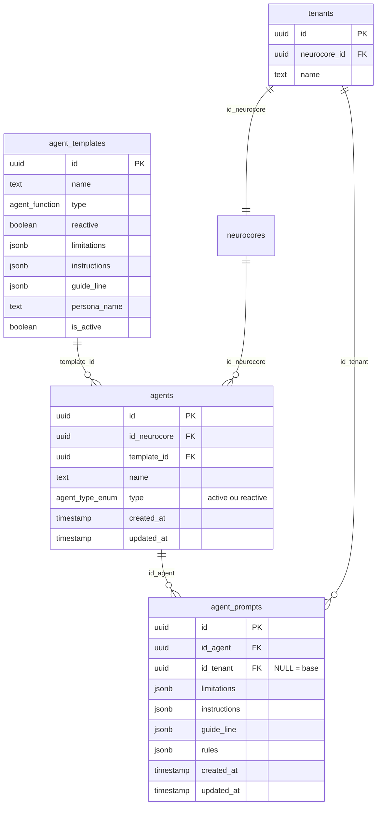

# Plano de Implementação: Agent Templates UI (Meus Agentes IA)

**Feature:** Plataforma Tenant - Interface para visualizar e editar configurações de Agents baseados em Templates
**Contexto:** [fluxo-edicao-prompts-tenant.md](file:///home/frank/projeto/docs/contexto/fluxo-edicao-prompts-tenant.md)
**Data:** 2025-12-04 (Implementado: 2025-12-05)
**Status:** ‚úÖ Implementado e Funcionando

---

## 📋 Índice

1. [Contexto e Objetivo](#contexto-e-objetivo)
2. [⚠️ Correções Implementadas](#correções-implementadas)
3. [An√°lise da Arquitetura Atual](#an√°lise-da-arquitetura-atual)
4. [Componentes e Estrutura](#componentes-e-estrutura)
5. [Regras de Negócio](#regras-de-negócio)
6. [Fluxo de Dados](#fluxo-de-dados)
7. [Implementação Detalhada](#implementação-detalhada)
8. [RLS e Segurança](#rls-e-segurança)
9. [Testes](#testes)
10. [Gaps e Riscos](#gaps-e-riscos)

---

## 🎯 Contexto e Objetivo

### Problema
Atualmente, a Plataforma Admin permite que Super Admins criem **Agent Templates** e os utilizem ao configurar **Neurocores**. Quando um **Tenant** é criado e associado a um Neurocore, o sistema copia a configuração base dos agents para registros específicos do tenant em `agent_prompts`.

**Falta:** Interface na **Plataforma Tenant** para que os tenants visualizem e **personalizem** as configurações dos seus agents (limitações, instruções, roteiro, personalidade).

### Solução
Implementar a tela **"Meus Agentes IA"** na Plataforma Tenant, permitindo:
- ‚úÖ Visualizar agents do neurocore associado ao tenant
- ✅ Ver configuração atual (herdada do template + personalizações)
- ✅ Editar prompts (limitações, instruções, guideline, personalidade)
- ✅ Resetar para configuração padrão do template
- ‚úÖ Indicar quais campos foram personalizados

### Benefícios
- Tenants podem adaptar agents ao contexto específico do negócio
- Autonomia sem depender do Super Admin
- Manutenção da rastreabilidade (template de origem)
- Isolamento multi-tenant garantido por RLS

---

## ⚠️ Correções Implementadas

Durante a implementação, foram identificadas várias divergências entre o plano inicial e a estrutura real do banco de dados. Esta seção documenta todos os problemas encontrados e as soluções aplicadas.

### 1. Schema do Banco de Dados

#### 1.1. Tabela `agents` - Colunas N√£o Existentes

**Problema:** O plano inicial assumia a existência de várias colunas que não existem na tabela `agents`:

- ❌ `function` - Não existe (é palavra reservada SQL)
- ‚ùå `reactive` - N√£o existe
- ‚ùå `persona` - N√£o existe
- ‚ùå `objective` - N√£o existe
- ‚ùå `personality_tone` - N√£o existe

**Solução:** As queries foram simplificadas para buscar apenas as colunas existentes:

```typescript
// ‚úÖ Query Correta
const { data: agentsData } = await supabase
  .from('agents')
  .select(`
    id,
    name,
    type,
    template_id,
    created_at,
    updated_at
  `)
  .eq('id_neurocore', neurocoreId);
```

#### 1.2. Tabela `tenants` - Nome da Coluna

**Problema:** Inconsistência no nome da coluna de referência ao neurocore:
- ‚ùå `tenants.id_neurocore` (n√£o existe)
- ‚úÖ `tenants.neurocore_id` (nome correto)

**Solução:** Todas as queries foram atualizadas para usar `neurocore_id`:

```typescript
const { data: tenantData } = await supabase
  .from('tenants')
  .select('neurocore_id')  // ‚úÖ Nome correto
  .eq('id', tenantId)
  .single();
```

#### 1.3. Campo `type` - Modo do Agent

**Problema:** O campo `type` é um enum `agent_type_enum` com valores:
- `active` = Proativo
- `reactive` = Reativo

**N√£o existe** um campo booleano `reactive` separado.

**Solução:** Badge de modo atualizado para ler o campo `type`:

```typescript
// ✅ Lógica Correta
<Badge variant="outline">
  {agent.type === 'active' ? 'Proativo' : 'Reativo'}
</Badge>
```

**Arquivos corrigidos:**
- `components/agents/agent-card.tsx:54`
- `components/agents/agent-edit-dialog.tsx:31`
- `components/agents/form-sections/basic-info-section.tsx:41`

### 2. RLS Policies

#### 2.1. Policy de Acesso aos Agents

**Problema:** As RLS policies iniciais estavam bloqueando o acesso aos agents do tenant.

**Solução:** Policy correta implementada em `/FIX-agents-rls-FINAL-WORKING.sql`:

```sql
CREATE POLICY "Tenants can view agents from their neurocore"
  ON agents
  FOR SELECT
  USING (
    id_neurocore = (
      SELECT neurocore_id
      FROM tenants
      WHERE id = (
        SELECT tenant_id
        FROM users
        WHERE id = auth.uid()
      )
    )
  );
```

**Pontos importantes:**
- `agents.id_neurocore` (n√£o `associated_neurocores`)
- `tenants.neurocore_id` (n√£o `id_neurocore`)
- Filtro correto: agents do mesmo neurocore do tenant

### 3. Campos JSONB

#### 3.1. Parsing de Campos JSONB

**Problema:** Campos JSONB (`limitations`, `instructions`, `guide_line`, `rules`) podem vir do Supabase como:
- Strings JSON: `"[\"item1\",\"item2\"]"`
- Objetos j√° parseados: `["item1", "item2"]`

Isso causava erro `[Object]` no formulário de edição.

**Solução:** Função `parseJSONBField()` implementada em `lib/queries/agents.ts:136-146`:

```typescript
function parseJSONBField(field: unknown): unknown {
  if (!field) return null;
  if (typeof field === 'string') {
    try {
      return JSON.parse(field);
    } catch {
      return null;
    }
  }
  return field;
}
```

**Aplicada em:** `getAgentsByTenant()` e `getAgentWithPrompt()` para todos os campos JSONB:
- `limitations`
- `instructions`
- `guide_line`
- `rules`

#### 3.2. Campo `rules`

**Problema:** O campo `rules` n√£o estava sendo buscado nas queries iniciais.

**Solução:** Adicionado parsing do campo `rules` em todas as funções que retornam prompts:

```typescript
const prompt = rawPrompt ? {
  ...rawPrompt,
  limitations: parseJSONBField(rawPrompt.limitations),
  instructions: parseJSONBField(rawPrompt.instructions),
  guide_line: parseJSONBField(rawPrompt.guide_line),
  rules: parseJSONBField(rawPrompt.rules),  // ‚úÖ Adicionado
} : {
  // ... empty prompt com rules: []
};
```

### 4. Fluxo de Dados Implementado

#### 4.1. Busca de Agents por Tenant

**Fluxo correto implementado:**

1. Buscar `neurocore_id` do tenant
2. Buscar agents com `id_neurocore = neurocore_id`
3. Buscar prompts com `id_agent IN (agentIds) AND id_tenant = tenantId`
4. Fazer join manual dos dados (n√£o via SQL join)
5. Aplicar `parseJSONBField()` em todos os campos JSONB

**Por que join manual?**
- Supabase RLS aplica filtros antes do JOIN
- JOIN SQL causava resultados vazios
- Separar queries garante que RLS funciona corretamente

### 5. Type Definitions

**Estrutura final correta em `types/agents.ts`:**

```typescript
export type Agent = {
  id: string;
  template_id: string | null;
  name: string;
  type: Database['public']['Enums']['agent_type_enum']; // 'active' | 'reactive'
  created_at: string;
  updated_at: string;
};

// Campo 'function' foi removido (n√£o existe no banco)
// Campos 'persona', 'objective' foram removidos (n√£o existem no banco)
```

### 6. Resumo das Correções

| Problema | Causa | Solução | Arquivo |
|----------|-------|---------|---------|
| Coluna `function` n√£o existe | Palavra reservada SQL | Removido das queries | `lib/queries/agents.ts` |
| Coluna `reactive` não existe | Campo é `type` enum | Usar `type === 'active'` | Todos os componentes |
| Coluna `tenants.id_neurocore` | Nome incorreto | Usar `neurocore_id` | `lib/queries/agents.ts:20` |
| RLS bloqueando acesso | Policy incorreta | Criar policy correta | `FIX-agents-rls-FINAL-WORKING.sql` |
| JSONB mostrando `[Object]` | Sem parsing | Criar `parseJSONBField()` | `lib/queries/agents.ts:136` |
| Campo `rules` n√£o aparece | N√£o estava na query | Adicionar parsing de rules | `lib/queries/agents.ts:100` |

### 7. Arquivos com Correções

**Backend:**
- ‚úÖ `lib/queries/agents.ts` - Queries simplificadas + parsing JSONB
- ‚úÖ `types/agents.ts` - Types atualizados para schema real
- ‚úÖ `FIX-agents-rls-FINAL-WORKING.sql` - RLS policy correta

**Frontend:**
- ‚úÖ `components/agents/agent-card.tsx` - Badge de modo corrigido
- ‚úÖ `components/agents/agent-edit-dialog.tsx` - Badge de modo corrigido
- ‚úÖ `components/agents/form-sections/basic-info-section.tsx` - Badge de modo corrigido

### 8. Status Atual

‚úÖ **6 agents** sendo exibidos corretamente para o tenant
‚úÖ **Badges de modo** atualizando dinamicamente (Proativo/Reativo)
‚úÖ **Campos JSONB** expandindo e mostrando conte√∫do
‚úÖ **Campo rules** sendo buscado e parseado
‚úÖ **RLS policies** isolando dados por tenant/neurocore
‚úÖ **Build** passando sem erros

---

## 🗄️ Análise da Arquitetura Atual

### Tabelas Relacionadas


```mermaid
erDiagram
    agent_templates ||--o{ agents : "template_id"
    agents ||--o{ agent_prompts : "id_agent"
    tenants ||--o{ agent_prompts : "id_tenant"
    neurocores ||--o{ agents : "id_neurocore"
    tenants ||--|| neurocores : "id_neurocore"

    agent_templates {
        uuid id PK
        text name
        agent_function type
        boolean reactive
        jsonb limitations
        jsonb instructions
        jsonb guide_line
        text persona_name
        boolean is_active
    }

    agents {
        uuid id PK
        uuid id_neurocore FK
        uuid template_id FK
        text name
        agent_type_enum type "active ou reactive"
        timestamp created_at
        timestamp updated_at
    }

    agent_prompts {
        uuid id PK
        uuid id_agent FK
        uuid id_tenant FK "NULL = base"
        jsonb limitations
        jsonb instructions
        jsonb guide_line
        jsonb rules
        timestamp created_at
        timestamp updated_at
    }

    tenants {
        uuid id PK
        uuid neurocore_id FK
        text name
    }
```

### Verificações Necessárias

**Antes de começar, verificar:**

1. **Coluna `template_id` existe?**
   ```sql
   SELECT column_name, data_type 
   FROM information_schema.columns 
   WHERE table_name = 'agents' AND column_name = 'template_id';
   ```

2. **Constraint de unicidade em `agent_prompts`?**
   ```sql
   -- Deve existir: UNIQUE(id_agent, id_tenant)
   SELECT constraint_name 
   FROM information_schema.table_constraints 
   WHERE table_name = 'agent_prompts' AND constraint_type = 'UNIQUE';
   ```

3. **RLS policies existem?**
   ```sql
   SELECT tablename, policyname, cmd, qual 
   FROM pg_policies 
   WHERE tablename IN ('agents', 'agent_prompts');
   ```

---

## üß© Componentes e Estrutura

### Arquitetura de Componentes

```
app/(dashboard)/meus-agentes/
└── page.tsx                          # Página principal (Server Component)

components/agents/
├── agents-list.tsx                   # Container com grid de cards
├── agent-card.tsx                    # Card individual
├── agent-edit-dialog.tsx             # Modal de edição
├── agent-prompt-form.tsx             # Formulário principal
├── form-sections/
│   ├── basic-info-section.tsx        # Read-only (nome, tipo, modo)
│   ├── personality-section.tsx       # Editável (persona, objetivo, etc)
│   ├── limitations-section.tsx       # Array de strings
│   ├── instructions-section.tsx      # Array de strings
│   └── guideline-section.tsx         # Estrutura JSONB especial
└── index.ts                          # Barrel export

lib/queries/agents.ts                 # Queries Supabase
app/actions/agents.ts                 # Server Actions
types/agents.ts                       # Types TypeScript
lib/validations/agentPromptValidation.ts # Schemas Zod
```

### Estrutura de Dados (Types)

```typescript
// types/agents.ts

export type Agent = {
  id: string;
  template_id: string | null;
  name: string;
  type: Database['public']['Enums']['agent_type_enum']; // 'active' | 'reactive'
  created_at: string;
  updated_at: string;
};

export type AgentPrompt = {
  id: string;
  id_agent: string;
  id_tenant: string; // NULL no banco = configuração base

  // Configurações JSONB
  limitations: string[] | null;
  instructions: string[] | null;
  guide_line: GuidelineStep[] | null;
  rules: string[] | null;

  created_at: string;
  updated_at: string;
};

export type GuidelineStep = {
  title: string;
  type: 'rank' | 'markdown'; // rank = numerado, markdown = formatado
  active: boolean;
  sub: GuidelineSubInstruction[];
};

export type GuidelineSubInstruction = {
  content: string;
  active: boolean;
};

export type AgentWithPrompt = Agent & {
  template_name: string | null; // Nome do template de origem (TODO: implementar lookup)
  prompt: AgentPrompt;
  is_customized: boolean; // Se foi personalizado pelo tenant
};

// Labels para exibição
export const AGENT_FUNCTION_LABELS: Record<string, string> = {
  attendant: 'Atendente',
  intention: 'Intenção',
  in_guard_rails: 'Guardrails',
  observer: 'Observador',
};
```

**⚠️ Nota:** Campos de personalidade (`persona`, `objective`, etc.) **não existem** na estrutura atual do banco de dados. Foram removidos da implementação.

---

## 📐 Regras de Negócio

### Campos Edit√°veis vs Read-Only

| Campo | Edit√°vel? | Justificativa |
|-------|-----------|---------------|
| **Nome do Agent** | ❌ | Estrutura técnica definida pelo Neurocore |
| **Tipo** (attendant/intention/etc) | ❌ | Estrutura técnica fixa |
| **Modo** (reativo/proativo) | ❌ | Estrutura técnica fixa |
| **Template de Origem** | ‚ùå | Apenas informativo (rastreabilidade) |
| **Limitações** | ✅ | Tenant pode adicionar/remover/editar |
| **Instruções** | ✅ | Tenant pode adicionar/remover/editar |
| **Guideline/Roteiro** | ✅ | Tenant pode personalizar etapas e sub-instruções |
| **Personalidade** | ‚úÖ | Tenant pode personalizar (nome, idade, objetivo, etc) |

### Fluxo de Personalização

1. **Tenant visualiza agent** ‚Üí Carrega prompt com `id_tenant = current_tenant_id`
2. **Tenant edita campo** ‚Üí Marcado como "personalizado"
3. **Tenant salva** ‚Üí `UPDATE agent_prompts WHERE id_agent = X AND id_tenant = Y`
4. **Tenant reseta** ‚Üí Copia valores do prompt base (`id_tenant = NULL`)

### Validações

- **Limitações**: Array de strings, mínimo 0, máximo 50 itens
- **Instruções**: Array de strings, mínimo 0, máximo 50 itens
- **Guideline**: Estrutura v√°lida (title, type, active, sub[])
- **Personalidade**: Campos opcionais, strings n√£o vazias

---

## 🔄 Fluxo de Dados

### 1. Listagem de Agents

**⚠️ Implementação Real:** A query usa **joins manuais** (queries separadas) devido às limitações do RLS do Supabase com JOINs SQL.

```typescript
// lib/queries/agents.ts
export async function getAgentsByTenant(tenantId: string) {
  const supabase = await createClient();

  // 1. Buscar o neurocore_id do tenant
  const { data: tenantData, error: tenantError } = await supabase
    .from('tenants')
    .select('neurocore_id')
    .eq('id', tenantId)
    .single();

  if (tenantError || !tenantData) {
    throw new Error('Tenant not found');
  }

  const neurocoreId = tenantData.neurocore_id;

  // 2. Buscar agents do neurocore do tenant
  const { data: agentsData, error: agentsError } = await supabase
    .from('agents')
    .select(`
      id,
      name,
      type,
      template_id,
      created_at,
      updated_at
    `)
    .eq('id_neurocore', neurocoreId)
    .order('name');

  if (agentsError || !agentsData || agentsData.length === 0) {
    return [];
  }

  // 3. Buscar os prompts do tenant para esses agents
  const agentIds = agentsData.map(a => a.id);

  const { data: promptsData, error: promptsError } = await supabase
    .from('agent_prompts')
    .select('*')
    .in('id_agent', agentIds)
    .eq('id_tenant', tenantId);

  // 4. Mapear prompts por agent_id
  const promptsMap = new Map();
  if (promptsData) {
    promptsData.forEach(prompt => {
      promptsMap.set(prompt.id_agent, prompt);
    });
  }

  // 5. Combinar agents com seus prompts (com parsing JSONB)
  const result = agentsData.map((agent: any) => {
    const rawPrompt = promptsMap.get(agent.id);

    const prompt = rawPrompt ? {
      ...rawPrompt,
      limitations: parseJSONBField(rawPrompt.limitations),
      instructions: parseJSONBField(rawPrompt.instructions),
      guide_line: parseJSONBField(rawPrompt.guide_line),
      rules: parseJSONBField(rawPrompt.rules),
    } : {
      // Prompt vazio se n√£o existir
      id: '',
      id_agent: agent.id,
      id_tenant: tenantId,
      limitations: [],
      instructions: [],
      guide_line: [],
      rules: [],
      created_at: new Date().toISOString(),
      updated_at: new Date().toISOString(),
    };

    return {
      ...agent,
      template_name: null, // TODO: Implementar lookup do template
      prompt,
      is_customized: checkIfCustomized(prompt),
    };
  }) as AgentWithPrompt[];

  return result;
}

// Helper para parsing de campos JSONB
function parseJSONBField(field: unknown): unknown {
  if (!field) return null;
  if (typeof field === 'string') {
    try {
      return JSON.parse(field);
    } catch {
      return null;
    }
  }
  return field;
}
```

### 2. Edição de Prompt

```typescript
// Server Action
async function updateAgentPrompt(
  agentId: string,
  tenantId: string,
  updates: Partial<AgentPrompt>
) {
  // 1. Validação
  const validated = agentPromptSchema.parse(updates);
  
  // 2. Update
  const { data, error } = await supabase
    .from('agent_prompts')
    .update(validated)
    .eq('id_agent', agentId)
    .eq('id_tenant', tenantId)
    .select()
    .single();
  
  return { data, error };
}
```

### 3. Resetar para Padr√£o

```typescript
// Server Action
async function resetAgentPromptToDefault(agentId: string, tenantId: string) {
  // 1. Buscar configuração base
  const { data: basePrompt } = await supabase
    .from('agent_prompts')
    .select('limitations, instructions, guide_line, rules, persona_name, age, ...')
    .eq('id_agent', agentId)
    .is('id_tenant', null)
    .single();
  
  // 2. Copiar para tenant
  const { data, error } = await supabase
    .from('agent_prompts')
    .update({
      limitations: basePrompt.limitations,
      instructions: basePrompt.instructions,
      guide_line: basePrompt.guide_line,
      // ... outros campos
    })
    .eq('id_agent', agentId)
    .eq('id_tenant', tenantId)
    .select()
    .single();
  
  return { data, error };
}
```

---

## 🛠️ Implementação Detalhada

### Fase 1: Setup e Types

**1.1. Verificar Schema Atual**
```bash
# Script de verificação
node scripts/verify-agent-schema.js
```

**1.2. Criar Types**
```typescript
// types/agents.ts
export type { Agent, AgentPrompt, GuidelineStep, AgentWithPrompt };
```

**1.3. Criar Validações Zod**
```typescript
// lib/validations/agentPromptValidation.ts
import { z } from 'zod';

export const guidelineSubInstructionSchema = z.object({
  content: z.string().min(1).max(500),
  active: z.boolean(),
});

export const guidelineStepSchema = z.object({
  title: z.string().min(1).max(200),
  type: z.enum(['rank', 'markdown']),
  active: z.boolean(),
  sub: z.array(guidelineSubInstructionSchema),
});

export const agentPromptSchema = z.object({
  limitations: z.array(z.string().min(1)).max(50).optional(),
  instructions: z.array(z.string().min(1)).max(50).optional(),
  guide_line: z.array(guidelineStepSchema).optional(),
  rules: z.array(z.string().min(1)).max(50).optional(),
  persona_name: z.string().min(1).max(100).optional(),
  age: z.string().max(50).optional(),
  gender: z.string().max(50).optional(),
  objective: z.string().max(500).optional(),
  communication: z.string().max(500).optional(),
  personality: z.string().max(500).optional(),
});
```

---

### Fase 2: Backend - Queries e Actions

**2.1. Queries**
```typescript
// lib/queries/agents.ts
import { createClient } from '@/lib/supabase/server';

export async function getAgentsByTenant(tenantId: string) {
  const supabase = await createClient();
  
  const { data, error } = await supabase
    .from('agents')
    .select(`
      id,
      name,
      type,
      reactive,
      template_id,
      agent_templates (name),
      agent_prompts!inner (*)
    `)
    .eq('agent_prompts.id_tenant', tenantId);
  
  if (error) throw error;
  return data;
}

export async function getAgentPrompt(agentId: string, tenantId: string) {
  const supabase = await createClient();
  
  const { data, error } = await supabase
    .from('agent_prompts')
    .select('*')
    .eq('id_agent', agentId)
    .eq('id_tenant', tenantId)
    .single();
  
  if (error) throw error;
  return data;
}

export async function getBaseAgentPrompt(agentId: string) {
  const supabase = await createClient();
  
  const { data, error } = await supabase
    .from('agent_prompts')
    .select('*')
    .eq('id_agent', agentId)
    .is('id_tenant', null)
    .single();
  
  if (error) throw error;
  return data;
}
```

**2.2. Server Actions**
```typescript
// app/actions/agents.ts
'use server';

import { revalidatePath } from 'next/cache';
import { createClient } from '@/lib/supabase/server';
import { agentPromptSchema } from '@/lib/validations/agentPromptValidation';

export async function updateAgentPromptAction(
  agentId: string,
  updates: unknown
) {
  const supabase = await createClient();
  
  // 1. Validar auth
  const { data: { user } } = await supabase.auth.getUser();
  if (!user) throw new Error('Unauthorized');
  
  // 2. Buscar tenant_id do usu√°rio
  const { data: userData } = await supabase
    .from('users')
    .select('tenant_id')
    .eq('id', user.id)
    .single();
  
  if (!userData?.tenant_id) throw new Error('Tenant not found');
  
  // 3. Validar schema
  const validated = agentPromptSchema.parse(updates);
  
  // 4. Update
  const { data, error } = await supabase
    .from('agent_prompts')
    .update(validated)
    .eq('id_agent', agentId)
    .eq('id_tenant', userData.tenant_id)
    .select()
    .single();
  
  if (error) throw error;
  
  revalidatePath('/meus-agentes');
  return { success: true, data };
}

export async function resetAgentPromptToDefaultAction(agentId: string) {
  const supabase = await createClient();
  
  // 1. Auth + tenant_id
  const { data: { user } } = await supabase.auth.getUser();
  if (!user) throw new Error('Unauthorized');
  
  const { data: userData } = await supabase
    .from('users')
    .select('tenant_id')
    .eq('id', user.id)
    .single();
  
  if (!userData?.tenant_id) throw new Error('Tenant not found');
  
  // 2. Buscar base prompt
  const { data: basePrompt } = await supabase
    .from('agent_prompts')
    .select('*')
    .eq('id_agent', agentId)
    .is('id_tenant', null)
    .single();
  
  if (!basePrompt) throw new Error('Base prompt not found');
  
  // 3. Copiar para tenant
  const { data, error } = await supabase
    .from('agent_prompts')
    .update({
      limitations: basePrompt.limitations,
      instructions: basePrompt.instructions,
      guide_line: basePrompt.guide_line,
      rules: basePrompt.rules,
      persona_name: basePrompt.persona_name,
      age: basePrompt.age,
      gender: basePrompt.gender,
      objective: basePrompt.objective,
      communication: basePrompt.communication,
      personality: basePrompt.personality,
    })
    .eq('id_agent', agentId)
    .eq('id_tenant', userData.tenant_id)
    .select()
    .single();
  
  if (error) throw error;
  
  revalidatePath('/meus-agentes');
  return { success: true, data };
}
```

---

### Fase 3: Componentes de Listagem

**3.1. P√°gina Principal**
```typescript
// app/(dashboard)/meus-agentes/page.tsx
import { AgentsList } from '@/components/agents';
import { getAgentsByTenant } from '@/lib/queries/agents';
import { createClient } from '@/lib/supabase/server';

export default async function MeusAgentesPage() {
  const supabase = await createClient();
  const { data: { user } } = await supabase.auth.getUser();
  
  const { data: userData } = await supabase
    .from('users')
    .select('tenant_id')
    .eq('id', user?.id)
    .single();
  
  const agents = await getAgentsByTenant(userData.tenant_id);
  
  return (
    <div className="container mx-auto py-6">
      <div className="mb-6">
        <h1 className="text-3xl font-bold">Meus Agentes IA</h1>
        <p className="text-muted-foreground">
          Gerencie as configurações dos seus agentes de inteligência artificial
        </p>
      </div>
      
      <AgentsList agents={agents} />
    </div>
  );
}
```

**3.2. Lista de Agents**
```typescript
// components/agents/agents-list.tsx
'use client';

import { AgentCard } from './agent-card';
import { AgentWithPrompt } from '@/types/agents';

interface AgentsListProps {
  agents: AgentWithPrompt[];
}

export function AgentsList({ agents }: AgentsListProps) {
  if (agents.length === 0) {
    return (
      <div className="text-center py-12">
        <p className="text-muted-foreground">
          Nenhum agente encontrado
        </p>
      </div>
    );
  }
  
  return (
    <div className="grid grid-cols-1 md:grid-cols-2 lg:grid-cols-3 gap-4">
      {agents.map(agent => (
        <AgentCard key={agent.id} agent={agent} />
      ))}
    </div>
  );
}
```

**3.3. Card do Agent**
```typescript
// components/agents/agent-card.tsx
'use client';

import { Card, CardHeader, CardTitle, CardDescription, CardContent, CardFooter } from '@/components/ui/card';
import { Badge } from '@/components/ui/badge';
import { Button } from '@/components/ui/button';
import { AgentEditDialog } from './agent-edit-dialog';
import { AgentWithPrompt } from '@/types/agents';
import { useState } from 'react';

interface AgentCardProps {
  agent: AgentWithPrompt;
}

export function AgentCard({ agent }: AgentCardProps) {
  const [isEditOpen, setIsEditOpen] = useState(false);
  
  const typeLabels = {
    attendant: 'Atendente',
    intention: 'Intenção',
    in_guard_rails: 'Guardrails',
    observer: 'Observador',
  };
  
  return (
    <>
      <Card>
        <CardHeader>
          <div className="flex items-center justify-between">
            <CardTitle>{agent.name}</CardTitle>
            {agent.is_customized && (
              <Badge variant="secondary">Personalizado</Badge>
            )}
          </div>
          <CardDescription>
            Tipo: {typeLabels[agent.type]}
          </CardDescription>
        </CardHeader>
        
        <CardContent className="space-y-2">
          {agent.template_name && (
            <div className="text-sm">
              <span className="text-muted-foreground">Template:</span>{' '}
              <span className="font-medium">{agent.template_name}</span>
            </div>
          )}
          
          <div className="text-sm">
            <span className="text-muted-foreground">Modo:</span>{' '}
            <Badge variant="outline">
              {agent.reactive ? 'Reativo' : 'Proativo'}
            </Badge>
          </div>
        </CardContent>
        
        <CardFooter>
          <Button 
            className="w-full" 
            onClick={() => setIsEditOpen(true)}
          >
            Editar Configuração
          </Button>
        </CardFooter>
      </Card>
      
      <AgentEditDialog 
        agent={agent}
        open={isEditOpen}
        onOpenChange={setIsEditOpen}
      />
    </>
  );
}
```

---

### Fase 4: Formulário de Edição

**Ver exemplos completos no arquivo artifact para:**
- Dialog de Edição (`agent-edit-dialog.tsx`)
- Formul√°rio Principal (`agent-prompt-form.tsx`)
- Seções do Formulário (Basic Info, Personality, Limitations, Instructions, Guideline)

O **Guideline Section** é o componente mais complexo, permitindo editar estrutura JSONB com:
- ‚ûï Adicionar/remover etapas
- ➕ Adicionar/remover sub-instruções
- 🔄 Toggle de ativação
- üé® Escolher tipo (numerado vs markdown)

---

## 🔐 RLS e Segurança

### RLS Policies Implementadas

**1. Agents - Tenant pode ver apenas agents do seu neurocore**

⚠️ **Policy Correta Implementada** (arquivo: `FIX-agents-rls-FINAL-WORKING.sql`):

```sql
CREATE POLICY "Tenants can view agents from their neurocore"
  ON agents
  FOR SELECT
  USING (
    id_neurocore = (
      SELECT neurocore_id
      FROM tenants
      WHERE id = (
        SELECT tenant_id
        FROM users
        WHERE id = auth.uid()
      )
    )
  );
```

**Pontos importantes desta policy:**
- ‚úÖ Usa `agents.id_neurocore` (coluna correta)
- ‚úÖ Usa `tenants.neurocore_id` (n√£o `id_neurocore`)
- ‚úÖ Subquery aninhada para buscar tenant_id do usu√°rio primeiro
- ‚úÖ Filtra agents do mesmo neurocore do tenant

**2. Agent Prompts - Tenant pode ver/editar apenas seus prompts**
```sql
CREATE POLICY "Tenants can view their own prompts"
  ON agent_prompts
  FOR SELECT
  USING (
    id_tenant = (
      SELECT tenant_id FROM users WHERE id = auth.uid()
    )
  );

CREATE POLICY "Tenants can update their own prompts"
  ON agent_prompts
  FOR UPDATE
  USING (
    id_tenant = (
      SELECT tenant_id FROM users WHERE id = auth.uid()
    )
  )
  WITH CHECK (
    id_tenant = (
      SELECT tenant_id FROM users WHERE id = auth.uid()
    )
  );
```

**3. Agent Templates - Tenant pode apenas visualizar (read-only)**
```sql
CREATE POLICY "Users can view active templates"
  ON agent_templates
  FOR SELECT
  USING (is_active = true);
```

### Testes de Segurança

```typescript
// Verificar isolamento multi-tenant
test('Tenant A n√£o pode editar prompts do Tenant B', async () => {
  // Simular usu√°rio do Tenant A tentando editar prompt do Tenant B
  const result = await updateAgentPromptAction(
    'agent-id-tenant-b',
    { limitations: ['Teste'] }
  );
  
  expect(result.error).toBeDefined();
  expect(result.error.code).toBe('PGRST116'); // RLS violation
});
```

---

## ‚úÖ Testes

### Checklist de Testes

**Backend:**
- [ ] Query `getAgentsByTenant` retorna apenas agents do tenant atual
- [ ] Query `getAgentPrompt` retorna prompt correto (tenant-specific)
- [ ] Server Action `updateAgentPromptAction` valida schema Zod
- [ ] Server Action `resetAgentPromptToDefaultAction` copia base corretamente
- [ ] RLS impede acesso a dados de outros tenants

**Frontend:**
- [ ] Lista de agents renderiza corretamente
- [ ] Cards exibem badge "Personalizado" quando aplic√°vel
- [ ] Dialog de edição abre/fecha corretamente
- [ ] Formulário valida campos obrigatórios
- [ ] Guideline section adiciona/remove etapas
- [ ] Guideline section adiciona/remove sub-instruções
- [ ] Toggle de ativação (etapas e sub-instruções) funciona
- [ ] Botão "Resetar" copia configuração base
- [ ] Toast de sucesso/erro aparece
- [ ] Build production passa sem erros

**Integração:**
- [ ] Salvar alterações atualiza banco imediatamente
- [ ] Revalidação de cache funciona (lista atualiza após editar)
- [ ] M√∫ltiplos tenants n√£o conflitam

---

## ⚠️ Gaps e Riscos

### Gaps Identificados

1. **Schema Verification Needed**
   - Verificar se `template_id` existe em `agents`
   - Verificar constraint UNIQUE em `agent_prompts`

2. **Migration Needed?**
   - Se `template_id` n√£o existir, criar migration
   - Se constraint UNIQUE n√£o existir, criar migration

3. **Personalização Persona**
   - Documento n√£o especifica se campos de personalidade est√£o em `agent_prompts` ou separado
   - **Decis√£o:** Assumir que est√£o em `agent_prompts` (mesmo tipo do template)

### Riscos

| Risco | Impacto | Probabilidade | Mitigação |
|-------|---------|---------------|-----------|
| RLS policies ausentes | Alto | Média | Verificar e criar policies antes de implementar UI |
| Schema divergente | Alto | Baixa | Executar script de verificação primeiro |
| Validação Zod muito restritiva | Médio | Média | Permitir campos opcionais, validar apenas não-vazios |
| Guideline section complexa demais | Médio | Alta | Implementar incrementalmente, testar UX |
| Performance em lista grande | Baixo | Baixa | Implementar paginação se necessário |

---

## 📝 Lições Aprendidas

### 1. Sempre Verificar o Schema Real

**Lição:** Documentos e arquivos `database.ts` podem ficar desatualizados.

**Solução:** Antes de implementar, sempre executar queries SQL para verificar:
```sql
-- Verificar colunas de uma tabela
SELECT column_name, data_type, is_nullable
FROM information_schema.columns
WHERE table_name = 'agents'
ORDER BY ordinal_position;

-- Verificar enums
SELECT e.enumlabel
FROM pg_enum e
JOIN pg_type t ON e.enumtypid = t.oid
WHERE t.typname = 'agent_type_enum';
```

### 2. RLS Policies com Subqueries Aninhadas

**Lição:** Supabase RLS requer cuidado com nomes de colunas e ordem de joins.

**Descoberta:** Policies com subqueries aninhadas funcionam melhor que JOINs:
```sql
-- ‚úÖ Funciona
id_neurocore = (SELECT neurocore_id FROM tenants WHERE id = (...))

-- ‚ùå Pode falhar
id_neurocore IN (SELECT neurocore_id FROM tenants JOIN users...)
```

### 3. Joins Manuais vs SQL Joins com RLS

**Lição:** RLS do Supabase pode bloquear resultados em queries com JOINs SQL.

**Solução:** Fazer joins manuais (queries separadas) garante que RLS funciona corretamente:
1. Query 1: Buscar tenant ‚Üí neurocore_id
2. Query 2: Buscar agents com id_neurocore
3. Query 3: Buscar prompts com id_tenant
4. Join em TypeScript com Map/forEach

### 4. Parsing de Campos JSONB

**Lição:** Supabase pode retornar JSONB como strings ou objetos dependendo do contexto.

**Solução:** Sempre aplicar função de parsing defensiva:
```typescript
function parseJSONBField(field: unknown): unknown {
  if (!field) return null;
  if (typeof field === 'string') {
    try {
      return JSON.parse(field);
    } catch {
      return null;
    }
  }
  return field;
}
```

### 5. Evitar Palavras Reservadas SQL

**Lição:** Palavras como `function`, `order`, `select` podem causar problemas mesmo com quotes.

**Descoberta:** No nosso caso, a coluna `function` simplesmente não existia, mas a lição se aplica.

### 6. Enums em TypeScript

**Lição:** Usar enums do `Database` type garante type-safety:
```typescript
type: Database['public']['Enums']['agent_type_enum']
```

Melhor que hardcoded:
```typescript
type: 'active' | 'reactive' // ‚ùå Pode ficar desatualizado
```

### 7. Logging é Essencial

**Lição:** Console.log detalhado ajuda a debugar problemas de RLS e parsing.

**Implementado em `lib/queries/agents.ts`:**
```typescript
console.log('[getAgentsByTenant] Fetching agents for tenant:', tenantId);
console.log('[getAgentsByTenant] Neurocore ID:', neurocoreId);
console.log('[getAgentsByTenant] Agents fetched:', agentsData?.length || 0);
console.log('[getAgentsByTenant] Found', promptsData?.length || 0, 'prompts for tenant');
```

### 8. Validação Incremental

**Lição:** Não assumir que campos existem - validar com optional chaining:
```typescript
agent.prompt?.limitations?.length > 0
```

---

## 📚 Referências

- [Documento de Contexto](file:///home/frank/projeto/docs/contexto/fluxo-edicao-prompts-tenant.md)
- [DECISIONS.md](file:///home/frank/projeto/docs/DECISIONS.md)
- [status-projeto.md](file:///home/frank/projeto/docs/status-projeto.md)
- [Supabase RLS](https://supabase.com/docs/guides/auth/row-level-security)
- [Zod Validation](https://zod.dev/)
- [React Hook Form](https://react-hook-form.com/)

---

## 🎯 Próximos Passos Imediatos

1. **Validar decis√£o**: Revisar plano com stakeholders
2. **Verificar schema**: Executar script de verificação
3. **Criar migration** (se necess√°rio): Adicionar `template_id` e constraints
4. **Implementar RLS**: Criar/verificar policies
5. **Iniciar Fase 1**: Setup de types e validações
