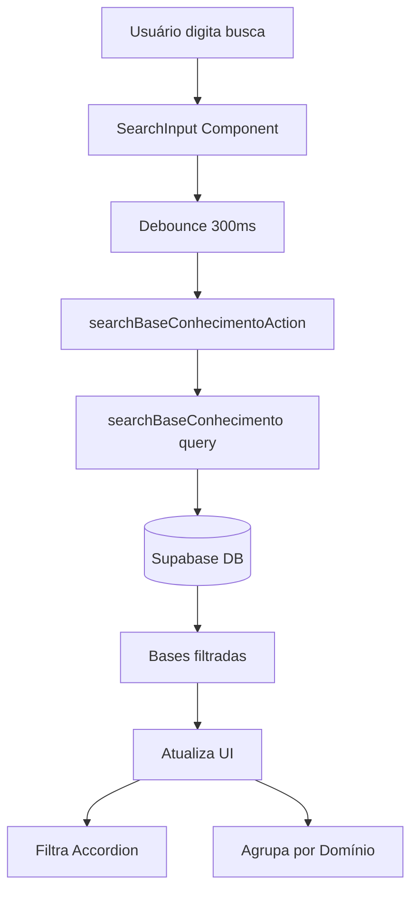

# Campo de Busca - Base de Conhecimento

## Visão Geral
Adicionar funcionalidade de busca que permite encontrar bases de conhecimento por nome ou descrição/conteúdo em todos os domínios do tenant. A busca será server-side (query no banco) e os resultados filtrarão o accordion existente.

## Arquitetura da Solução



## Implementação

### 1. Query de Busca no Banco de Dados

**Arquivo**: `lib/queries/knowledge-base.ts`

Adicionar nova função `searchBaseConhecimento` que:
- Busca em `base_conhecimentos` usando `ilike` no Supabase
- Filtra por `name` OU `description` contendo o termo de busca
- Filtra por `tenant_id` para segurança
- Retorna bases com informações do domínio (join com `knowledge_domains`)
- Ordena por relevância (prioriza match no nome, depois na descrição)

```typescript
export async function searchBaseConhecimento(
  tenantId: string,
  searchTerm: string
): Promise<BaseConhecimentoWithDomain[]>
```

### 2. Server Action para Busca

**Arquivo**: `app/actions/base-conhecimento.ts`

Adicionar `searchBaseConhecimentoAction` que:
- Valida o termo de busca (mínimo 2 caracteres)
- Chama a query de busca
- Retorna resultados ou erro

### 3. Componente de Input de Busca

**Novo arquivo**: `components/knowledge-base/search-input.tsx`

Criar componente client-side com:
- Input com ícone de busca (usando `lucide-react`)
- Debounce de 300ms para evitar muitas requisições
- Estado de loading durante a busca
- Botão para limpar busca
- Design consistente com shadcn/ui

### 4. Atualizar Componente Principal

**Arquivo**: `components/knowledge-base/knowledge-base-page-content.tsx`

Modificações:
- Adicionar estado para `searchTerm` e `searchResults`
- Adicionar componente `SearchInput` acima do carousel
- Implementar lógica de busca que chama a Server Action
- Quando há busca ativa:
  - Esconder/desabilitar o carousel de domínios
  - Agrupar resultados por domínio
  - Mostrar accordion com resultados filtrados
  - Exibir mensagem "X resultados encontrados para 'termo'"
- Quando busca está vazia: voltar ao comportamento normal

### 5. Adaptar Accordion para Resultados de Busca

**Arquivo**: `components/knowledge-base/domain-bases-accordion.tsx`

Ajustes:
- Adicionar prop opcional `searchMode?: boolean`
- Quando em modo de busca, mostrar nome do domínio junto com cada base
- Exibir mensagem "Nenhum resultado encontrado" quando busca não retorna resultados
- Manter todas as funcionalidades existentes (editar, deletar, toggle)

## Fluxo de Uso

1. Usuário digita no campo de busca
2. Após 300ms de inatividade, busca é executada no servidor
3. Resultados são agrupados por domínio e exibidos no accordion
4. Usuário pode expandir/editar/deletar bases normalmente
5. Ao limpar a busca, volta à visualização por domínio selecionado

## Detalhes Técnicos

- **Performance**: Debounce evita requests excessivos
- **Segurança**: Query filtra por `tenant_id`
- **UX**: Loading state durante busca
- **Acessibilidade**: Input com label e aria-label apropriados
- **Busca case-insensitive**: Usando `ilike` do Postgres

## Arquivos Modificados/Criados

1. ✏️ `lib/queries/knowledge-base.ts` - adicionar query de busca
2. ✏️ `app/actions/base-conhecimento.ts` - adicionar action de busca
3. ➕ `components/knowledge-base/search-input.tsx` - novo componente
4. ✏️ `components/knowledge-base/knowledge-base-page-content.tsx` - integrar busca
5. ✏️ `components/knowledge-base/domain-bases-accordion.tsx` - suportar modo de busca

## Status da Implementação

✅ **Concluído** - Todos os arquivos foram implementados e testados

### Arquivos Criados
- ✅ `components/knowledge-base/search-input.tsx`

### Arquivos Modificados
- ✅ `lib/queries/knowledge-base.ts`
- ✅ `app/actions/base-conhecimento.ts`
- ✅ `components/knowledge-base/knowledge-base-page-content.tsx`
- ✅ `components/knowledge-base/domain-bases-accordion.tsx`
- ✅ `components/knowledge-base/index.ts`

### Correções Adicionais
- ✅ Corrigido erro de lint em `lib/queries/knowledge-base.ts` (prefer-const)
- ✅ Corrigido erro TypeScript em `knowledge-base-page-content.tsx` (null index)
- ✅ Corrigido erro no build em `app/api/dashboard/route.ts` (unused parameter)
- ✅ Instaladas dependências faltantes `@tanstack/react-query`
- ✅ Corrigido erro em `hooks/use-dashboard-data.ts` (Error constructor)

## Funcionalidades Implementadas

✅ Busca em todos os domínios do tenant  
✅ Busca por nome ou conteúdo (descrição)  
✅ Busca case-insensitive usando Postgres `ilike`  
✅ Debounce de 300ms para performance  
✅ Loading state durante a busca  
✅ Resultados agrupados por domínio  
✅ Filtro no accordion com manutenção das funcionalidades  
✅ Segurança com filtro por tenant_id  
✅ UX com mensagens apropriadas e feedback visual  

## Como Usar

1. Digite no campo de busca no topo da página
2. Aguarde 300ms (debounce)
3. Resultados aparecem automaticamente agrupados por domínio
4. Todas as ações (editar, deletar, toggle) funcionam normalmente nos resultados
5. Limpe a busca para voltar à visualização por domínio


